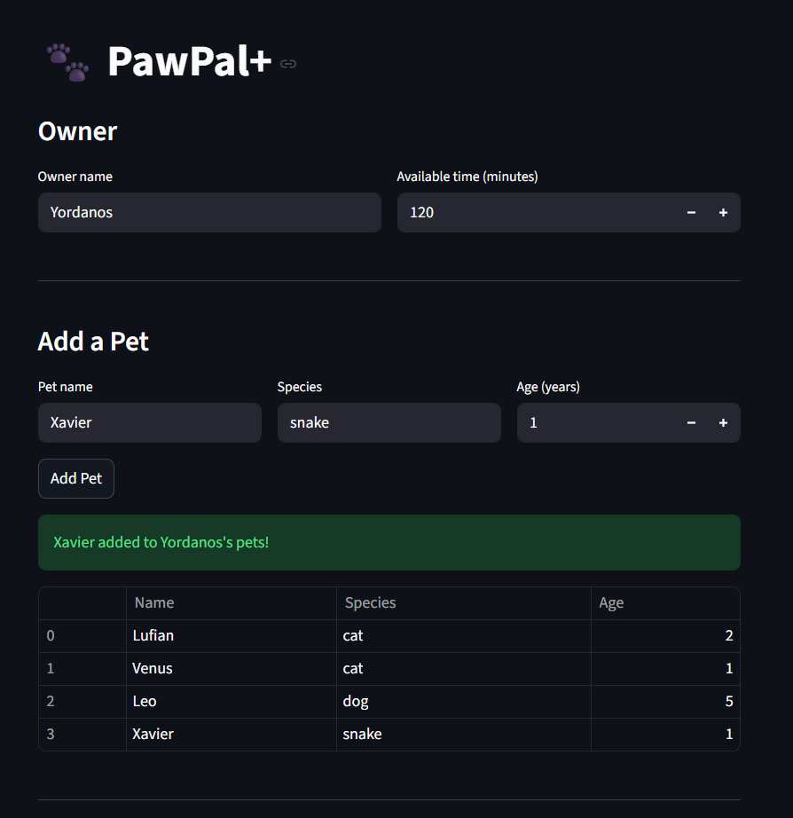
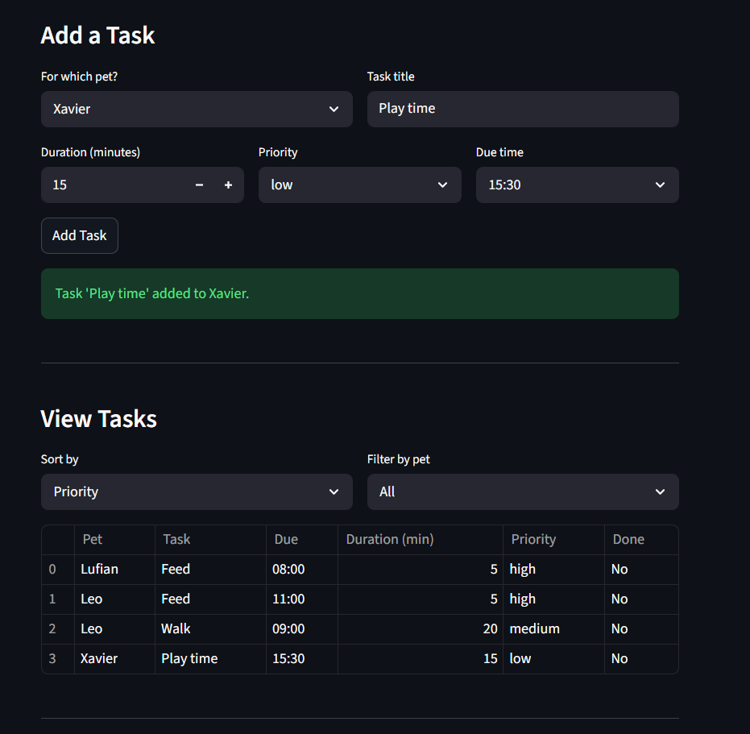
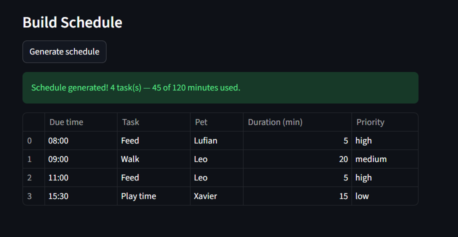

# PawPal+ (Module 2 Project)

You are building **PawPal+**, a Streamlit app that helps a pet owner plan care tasks for their pet.

## Scenario

A busy pet owner needs help staying consistent with pet care. They want an assistant that can:

- Track pet care tasks (walks, feeding, meds, enrichment, grooming, etc.)
- Consider constraints (time available, priority, owner preferences)
- Produce a daily plan and explain why it chose that plan

Your job is to design the system first (UML), then implement the logic in Python, then connect it to the Streamlit UI.

## What you will build

Your final app should:

- Let a user enter basic owner + pet info
- Let a user add/edit tasks (duration + priority at minimum)
- Generate a daily schedule/plan based on constraints and priorities
- Display the plan clearly (and ideally explain the reasoning)
- Include tests for the most important scheduling behaviors


## Getting started

### Setup

```bash
python -m venv .venv
source .venv/bin/activate  # Windows: .venv\Scripts\activate
pip install -r requirements.txt
```

### Suggested workflow

1. Read the scenario carefully and identify requirements and edge cases.
2. Draft a UML diagram (classes, attributes, methods, relationships).
3. Convert UML into Python class stubs (no logic yet).
4. Implement scheduling logic in small increments.
5. Add tests to verify key behaviors.
6. Connect your logic to the Streamlit UI in `app.py`.
7. Refine UML so it matches what you actually built.

## Smarter Scheduling / Features

- **Conflict detection** — warns if two tasks are scheduled at the same time
- **Recurring tasks** — completing a task auto-schedules the next one (daily or weekly)
- **Sort by time** — lists tasks in order of due time
- **Sort by priority** — lists tasks in order of priority
- **Filter by pet** — shows tasks for a specific pet
- **Filter by priority** — shows tasks above a given priority level

## Testing PawPal+

**Command to run tests:**

```bash
python -m pytest
```

**What the tests cover:**

- Task completion changes the completed status
- Adding a task to a pet adds to its task list
- Sorting returns tasks in chronological order
- Completing a daily task schedules a follow-up a day later
- Two tasks at the same time trigger a conflict warning
- Two tasks at different times do not trigger a conflict warning

**Confidence Level:** 4/5

## Demo
<a href="demo_1.png" target="_blank"></a>
<a href="demo_2.png" target="_blank"></a>
<a href="demo_3.png" target="_blank"></a>